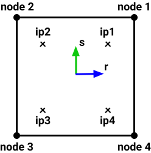
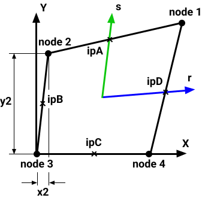

## Finite element types

|Name|IP location|
|:-:|:-:|
|Truss2n1ip| ip1 (r = 0)|
|Beam2n1ip| ip1 (r = 0)|
|Mem4n4ip| ip1 (r = 0.577, s = 0.577) ip2 (r = -0.577, s = 0.577) ip3 (r = -0.577, s = -0.577)  ip4 (r = 0.577, s = -0.577)|
|Plate4n4ipT| For tension and bending strain: ip1 (r = 0.577, s = 0.577) ip2 (r = -0.577, s = 0.577) ip3 (r = -0.577, s = -0.577) ip4 (r = 0.577, s = -0.577)  For shear strain: ipA (x = x1 - x2 - x3 + x4) ipA (y = y1 - y2 - y3 + y4) ipB (x = x1 - x2 + x3 - x4) ipB (y = y1 - y2 + y3 - y4) ipC (x = x1 + x2 - x3 - x4) ipC (y = y1 + y2 - y3 - y4)|
